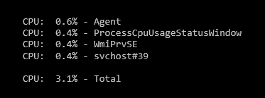

Now that I've written about my [FloatingStatusWindow](https://github.com/ckaczor/FloatingStatusWindow) library I can start to talk about the projects that use it. First up is the [ProcessCpuUsageStatusWindow](https://github.com/ckaczor/ProcessCpuUsageStatusWindow) project.

It is basically a mini task manager showing the top X processes by CPU usage and the total CPU usage of the system. The values update automatically every 2 seconds.

CPU usage is calculated by taking a snapshot of "% processor time" for the "Process" performance counter category every 2 seconds and having the counter sample calculate the percent usage for each process based on the previous snapshot.

This ended needing a lot more calculation than I had hoped although I don't remember all the details as to why - one of the perils of blogging so long after the code was written. From what I remember what I first tried was built into .NET and was easier to code but used a lot more processor time than I was comfortable with. Perhaps that has since been fixed in a later framework version - someday I'll have to try to recreate what I was doing.

One caveat - the code doesn't always work quite right. I have seen a few times where the calculation comes out way over 100% but I haven't been able to reliably reproduce it. It seems to be when either something hangs Windows or there's exceptionally high disk usage. Either way - it works well enough for getting a quick look at CPU usage so I haven't spent much time on it.

This was also the first project where I tried using [Squirrel](https://github.com/Squirrel/Squirrel.Windows) for installation and updates. I had used both [WiX](http://wixtoolset.org/) (with custom update detection and installation) and [ClickOnce](https://en.wikipedia.org/wiki/ClickOnce) in other projects and I think I'll probably go with Squirrel for most things going forward.
