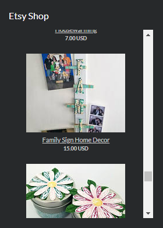
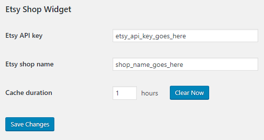

My wife and a friend run The Crafty Coop (edit: now closed) - an event planning business that also sells handmade party decorations/favors online and at craft shows. One of the ways I help out is as the designated "IT guy" by handling the web/email hosting and other technical stuff.

When we were initially setting up the website using WordPress we looked for a widget that would generate a listing of their Etsy shop items but we weren't really happy with the ones we found - they either required that the Etsy shop be broken up into sections or they didn't quite display the way we wanted. I decided to try to write my own instead of tweaking one of the existing ones and [Etsy Shop Widget](https://github.com/ckaczor/etsy-shop-widget) was born.

[](images/etsy-shop-widget-widget.png)

I decided early on that I wanted to avoid generating the HTML in PHP as much as possible. I knew I'd have use some PHP for the WordPress admin settings but I wanted to use a front-end framework for the widget itself. I was already using [Vue.js](https://vuejs.org/) in other projects so when I found a [template project](https://github.com/caldera-learn/vue-webpack-wordpress-plugin) for creating a WordPress plugin that used Vue.js I was good to go.

The [Etsy API](https://www.etsy.com/developers/documentation/getting_started/api_basics) requires an API key and is rate limited so I wanted to cache the results rather than fetch them each time the page loaded. I added standard WordPress settings for the API key, the shop name, and the cache time and put them all in a settings section.

[](images/etsy-shop-widget-settings.png)

Right now this limits the widget to only one shop per WordPress installation but that's all we need right now. In the future I'll move the shop name to an attribute of the widget instead.

On the back end I created a custom WordPress action that uses the WordPress [transients API](https://codex.wordpress.org/Transients_API) to store the cached data from Etsy. Basically if get\_transient returns some data then that data is simply returned to the caller, otherwise wp\_remote\_request is used to make the call to the Etsy API and the returned data is stored using set\_transient with the appropriate cache duration.

```php
function ESW_Listings_request()
{
    $listings = get_transient('etsy_shop_widget_listings');

    if ($listings === false) {
        $options = get_option('ESW_settings');

        $response = wp_remote_request('https://openapi.etsy.com/v2/shops/' . $options['ESW_Etsy_Shop_Name'] . '/listings/active?includes=MainImage&amp;amp;amp;amp;amp;api_key=' . $options['ESW_Etsy_API_Key'] . '');

        $listings = $response['body'];

        set_transient('etsy_shop_widget_listings', $listings, $options['ESW_Cache_Time'] * 60);
    }

    echo $listings;

    die();
}

add_action('admin_post_esw_listings', 'ESW_Listings_request');
add_action('admin_post_nopriv_esw_listings', 'ESW_Listings_request');
```

The rest of the PHP side is pretty straightforward - there's an "\[etsy-shop-widget\]" shortcode that generates an empty div with an ID of "etsy-shop-widget" that is used as the root of the Vue.js application and some code that links the styles and scripts generated by webpack when building the Vue.js code.

The front-end code is currently pretty basic as well. The Vue.js application just makes an AJAX request to the WordPress custom action, stores the resulting data in a component, and then uses the data to render a list of the item names, pictures, and prices.

```jscript
@Component
export default class App extends Vue {
	listings: Array<EtsyListing> | null = null;

	async mounted() {
		const response = await Axios.get<EtsyResult>(window['esw_wp'].siteurl + '/wp-admin/admin-post.php?action=esw_listings');

		this.listings = response.data.results.sort((a, b) => a.last_modified_tsz - b.last_modified_tsz);
	}
}
```

```xml
<template>
	<div class="esw-listing-container">
		<div class="esw-listing-item" v-for="listing in listings" v-bind:key="listing.listing_id">
			<a :href="listing.url" target="_blank">
				
			</a>

			<a :href="listing.url" target="_blank">
				<div class="esw-listing-item-title" v-html="listing.title"></div>
			</a>

			<div class="esw-listing-item-price">
				{{ listing.price }}
				{{ listing.currency_code }}
			</div>
		</div>
	</div>
</template>
```

At some point I'd like the make the listing a little fancier - maybe with a single image and previous/next buttons rather than a simple scrolling list but we're happy with the way it is working for now.
