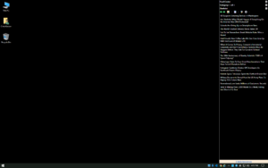
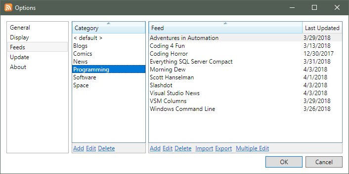

One of my most complete projects is [Feed Center](https://github.com/ckaczor/FeedCenter) - an RSS feed reader designed to blend in with the Windows desktop.

Years ago when push technology was the hot new thing I got my online news from applications like PointCast and MSNBC News Alert - but they were eventually discontinued as web sites moved to other delivery mechanisms like RSS feeds. I tried to find an RSS reader but never really found one that I liked. I didn't want some Outlook lookalike that I had to specifically open and read through. I wanted an app that would blend in with my desktop as much as possible and be something that I could glance at every so often for the latest news. At some point I started fiddling with creating my own and Feed Center is the result.

In theory Feed Center supports all of the common RSS versions and Atom with some special handling for common errors. The fact that I'm parsing the feeds with an XML parser makes it a little harder to handle the edge cases but it works well enough so far.

Feeds are added in a "default" category but they can optionally be organized into any number of other categories. The top of the main window has a selector for the current category - I'm not sure I like the way it looks but I haven't come up with anything better yet.

The arrows at the top of the window (as well as mouse buttons 4 and 5 if you have them) will scroll through the feeds in the current category in alphabetical order. The current feed will also scroll automatically every minute unless the mouse is hovering over the window - it would be annoying to have the feed change when you're getting ready to read one.

Double clicking an article will open the web page for the article. By default the system default browser will be used but there's an option to choose another browser instead. There's also buttons to open all of the articles for the current feed and to mark all of the articles as having been read.

The code base has had some major changes over the years - originally the UI was done using WinForms and I used XML files as storage. After a few corrupt XML files from power failures I switched to using SQLite and then to SQL Server Compact. At some point I rewrote the UI using WPF so I could get rid of a bunch of custom painting for the feed list.

The project has a full installer created with [WiX](http://wixtoolset.org/) that uses a [modified bootstrapper](https://github.com/ckaczor/WixBalExtensionExt) to automatically relaunch the application after an upgrade.

Other than the code on GitHub I haven't made anything public yet but I plan to use [AppVeyor](https://www.appveyor.com/) for build and deployment at some point - probably with the installer served as a GitHub release.
