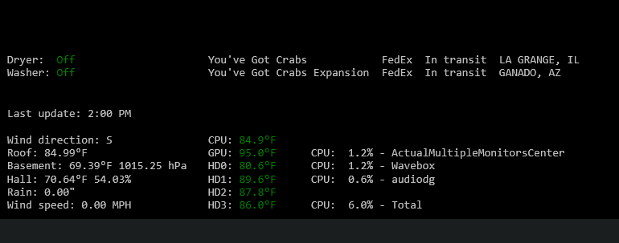
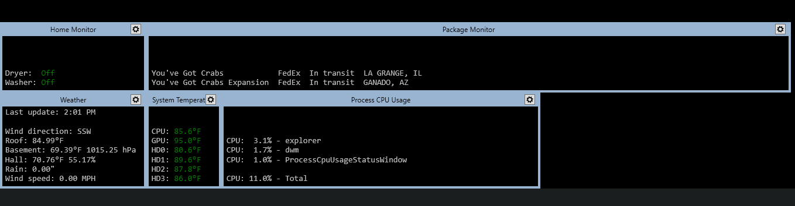
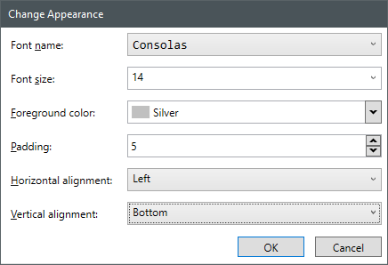

Something that shows up in a lot of my projects is my [FloatingStatusWindow](https://github.com/ckaczor/FloatingStatusWindow) library. It allows the creation of something akin to a desktop widget that displays simple text and blends in with the Windows desktop. This is what several of them look like in the corner of my secondary monitor:

<!-- excerpt -->

Each one is a separate project that uses the core library to create and manage the window. The code for a few of these is on [GitHub](https://github.com/ckaczor) and I'm working to add more.

The windows are locked by default to prevent accidentally moving them but they can be unlocked in order to move or resize them. When moving or resizing the windows will snap to each other and the sides of the screen. This is what the example above looks like unlocked:

Basic appearance settings are built into the library itself along with a dialog to change them:

Each individual project is responsible for the text, the text layout, using a non-default text color, and keeping the text up to date. Some projects will update using a timer while others will wait for some sort of event and update as needed.

I had tried a number of applications that could do custom widgets but none of them quite worked the way I wanted. I read an article about transparent WPF windows and decided to create something myself.

Originally it was implemented as a single application that could load a number of plugins but that ended up being a bit of a pain - when working on a new window I had to close and restart everything and if a plugin crashed it'd take down all of the rest. I decided to convert it into a library that could detect other instances of the window so they worked together but were implemented as separate binaries.

There will be more about the library later when I write about the various applications that use it.
