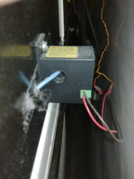
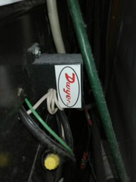
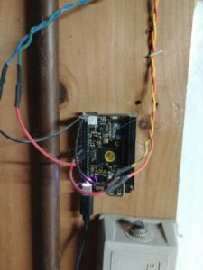

The next project up is [LaundryMonitor](https://github.com/ckaczor/LaundryMonitor) which uses the most hardware of anything I've done so far.

I'd always wanted something that would let us tell if the washing machine or dryer was running but I never knew exactly the right way to detect it. After we got our solar panels I was doing research on how to track power usage and came across an article about current sensors and had the idea that I could hook up a current sensor to each appliance and watch the output voltage to know if the appliance was running. While trying to find a decent sensor I stumbled across a current switch which was more or less the same idea but had everything in one package - when the current was over a certain threshold the switch would close and that could be easily detected.

My first thought was to use a [PowerState Tail](http://www.powerswitchtail.com/powerstate-tail) but only a 120V version was available - there was nothing like it I could use for the 240V of the dryer. Eventually I settled on a [Dwyer Miniature Current Switch](https://smile.amazon.com/gp/product/B00I9IFJOM/ref=oh_aui_search_detailpage?ie=UTF8&psc=1) and I'd use one each for both the washer and dryer just to be consistent.

Next up was to figure out how to monitor the switch. I was going to use a [Phidget I/O Board](https://www.phidgets.com/?tier=1&catid=2&pcid=1) attached to a central server and run wires across the house from the washer and dryer to the I/O board but the idea of running all the wires wasn't too appealing. I was about to try some sort of [XBee](https://www.sparkfun.com/pages/xbee_guide) setup when I found the [C.H.I.P.](https://getchip.com/pages/chip) Kickstarter and it seemed like it was worth a try - the C.H.I.P. was cheap, had digital I/O, had WiFi, and I could use anything that'd run on Linux to make it all work. The full board is probably a bit of overkill for just monitoring two switches but at $9 a device it really didn't bother me that much.

Hooking up the dryer was relatively easy - I opened the control panel, used the schematic to find the wire that powers the motor, disconnected the wire, ran the wire through the current switch, and reconnected the wire. I mounted the sensor on the back of the dryer for easy access in case I needed to adjust it but the motor draws enough current that the switch was able to detect it easily.

The washer was pretty much the same but I decided to monitor the main power line so I could detect if the washer was running at any point in the cycle. The trouble was that at certain times (like when the washer was filling) the current draw was way too low for the switch to detect even with the sensitivity set as low as possible. I solved this by looping the wire through the sensor several times to amplify the current to the point where the switch could pick it up.

From here on out things were simple - I just had to run some smaller wires from the switch to the digital I/O ports on the C.H.I.P. and then start working on the software. I ended up sticking the C.H.I.P. a few feet away by the power outlet so I didn't need too long a USB cable to power it.

So far this has been running for a little over two years and the hardware continues to work well. I'm planning to do a similar build to monitor two sump pumps - the only change is that I'm planning to use the PowerState Tail since they're both 120V with standard plugs so it'll be a lot easier to hook up.

I'll cover the software side of the project in my next post - right now the monitor is a standalone service that does all the work but since I'm going to be adding more devices I'm thinking that I need to break things up a bit.
