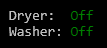
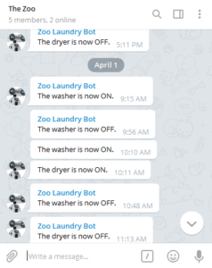

The software side of [LaundryMonitor](https://github.com/ckaczor/LaundryMonitor) is currently pretty straightforward. The [C.H.I.P.](https://getchip.com/pages/chip) runs a Node.js application that keeps track of a GPIO pin for each current switch - when the switch is closed the appliance is on and when the switch is open the appliance is off. The application exposes a websocket that applications like [HomeStatusWindow](https://github.com/ckaczor/HomeStatusWindow) can watch and messages are sent to a family Telegram channel.

<!-- excerpt -->

I use the [onoff](https://github.com/fivdi/onoff) library to poll the GPIO pins every 500 milliseconds and wait for a pin to be steady for 10 seconds before registering the new state. Originally I tried to use an interrupt but during testing I found that the onoff library could get stuck if switch events came in too fast. I decided that I didn't need real-time updates so a polling mechanism would be enough. I also originally didn't have the 10 second wait time but I found that the washer had a few periods where it would stop completely between wash phases and it made the Telegram alerts somewhat spammy. It looks like there have been a lot of updates to onoff since I first created the application so I plan to see if the interrupt issue has been fixed and if I can use the new debounce support rather than my own custom code.

Since I'm planning to monitor more devices in the future I'm thinking about making the application that runs on each C.H.I.P. generic and moving the alert and websocket implementation to a central "home monitor" service. The monitor application on each C.H.I.P. would be the same (other than configuration settings) and just report the status to the central service which would be in charge of everything else.
