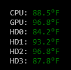

Next up in the "floating status window" category is [SystemTemperatureStatusWindow](https://github.com/ckaczor/SystemTemperatureStatusWindow). This one does exactly what it says on the tin - it shows various system temperature values.

The sensor data is read using the [Open Hardware Monitor](http://openhardwaremonitor.org/) library which is pretty straightforward - the one catch is that it requires running as an administrator and getting a UAC prompt each time the application starts got a bit annoying after a while.

I first tried to solve this by splitting the application into two parts - a Windows service that ran with administrator privileges to read the sensors and a normal application to handle the display. While this got past the annoying UAC prompts (after the service was installed) I found that Windows doesn't let you get GPU information from inside a Windows service.

After doing some more research I came across a workaround of using the Windows Task Scheduler to run the service as an administrator. I just turned the service into a regular application and set up the Task Scheduler to run it on system startup - problem solved.

Later on I added some command line switches to the service application that'd do the installation automatically. All I had to do was run the service once with a command line of "-install" and everything would get setup properly with just one UAC prompt.

I haven't gotten around to adding an installer for this one yet but I definitely have plans to do so. I expect some minor complications setting up the service in Squirrel due to the need for administrator access but I think it'll end up being doable.
