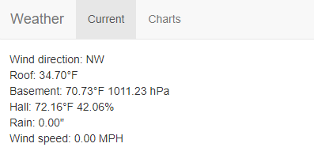
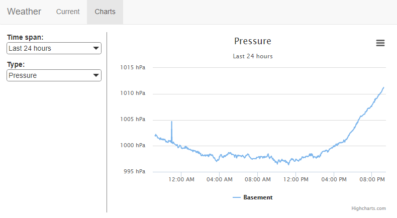
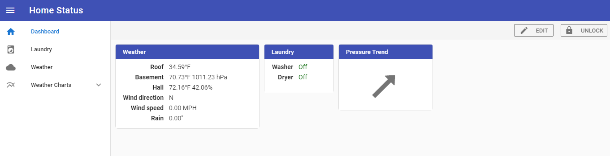
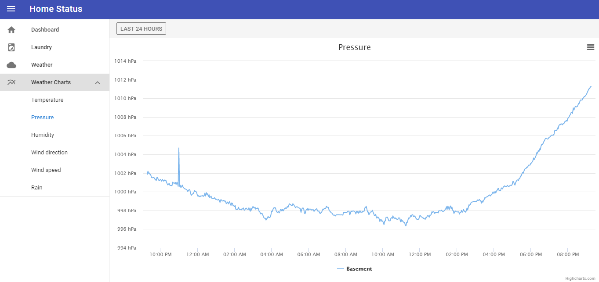

One of the oldest projects I'm still working on today is my weather station. I had always wanted a weather station but it seemed boring to just install something on the roof, stick an LCD display on the wall somewhere, and then forget about it - I wanted something I could build, expand on, and write my own software for.

<!-- excerpt -->

At some point I ran across a [weather station](http://www.eham.net/reviews/detail/4643) from AAG Electronica - it was relatively cheap, had a bunch of sensors, and ran on the Dallas Semiconductor (now Maxim Integrated) [1-Wire network](https://www.maximintegrated.com/en/products/digital/one-wire.html). It was pretty much everything that I was looking for so I bought one, mounted it on the chimney, and set about writing an application for it.

At the time I was starting to learn C# and decided this would make a perfect learning project. There were a few examples for using the 1-Wire hardware (mostly in Java from what I remember) but I was able to access the driver functions from C# and started to get things working. At the lowest level there was a lot of bit manipulation but once that was going I was able to start building the application up from there.

The code and application has changed quite a bit over the years. Originally it was split into two libraries - one for the 1-Wire network and one for weather devices like temperature and pressure - and a WinForms application that displayed the current readings and graphs of the last 24 hours of readings.

Eventually I wanted to view the readings remotely so the application was refactored into a service that ran on the server with the hardware connection and a viewer that could run anywhere. It used .NET remoting (the recommended technique at the time) to connect the two pieces. This worked okay for a while and I created a few different applications to view the data - more about them in later posts.

Later when I got a smartphone it made sense to create something that would let me view things from my phone. I started down the path of creating an Android application but then decided that it'd be better to create a web application that could be used everywhere. I added a [SignalR](https://www.asp.net/signalr) interface to the service and created a basic AngularJS 1.x web application as the viewer.

The AngularJS 1.x application worked well for a while but started to show its age so I decided to re-write it with Vue.js and that's where things are now. The new web application also integrates with some of my more recent projects like the laundry monitor that I'll write more about soon.

At this point the [WeatherService](https://github.com/ckaczor/WeatherService) project is responsible for reading the sensors, writing the readings to the database, and providing historical data for charting. It still uses my original [OneWireAPI](https://github.com/ckaczor/OneWireAPI) library to access the 1-Wire network.

Unfortunately AAG seems to have gone out of business so it is probably impossible to create the same setup or for me to get replacement parts. I've been looking at some off-the-shelf weather stations that I can read in a similar way but I haven't found anything I like so far. I'll probably be forced to find something soon since I'm starting to have some problems that look like hardware issues.
